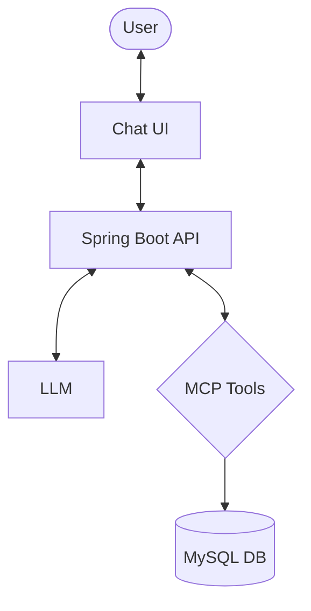

# Spring AI + MCP 

A modern AI application demonstrating the integration of **Spring AI** with **Model Context Protocol (MCP)** tools, featuring a beautiful React frontend and a MySQL-backed knowledge base.

---

## 🏗️ Architecture

The system uses a **Function Calling** (ReAct) pattern where the LLM acts as an agent. It intelligently routes user queries to the appropriate tools registered via Spring AI's `ChatClient`.



---

## ✨ Current Features

- **Rich Chat Interface**: A responsive and premium UI built with Next.js and Tailwind CSS (located in `/chatbot-ui`).
- **Spring AI Integration**: Native integration with OpenAI using Spring AI's `ChatClient`.
- **MySQL Tool (MCP)**:
    - `getFeesStatusByStrategyCode`: Look up fee status (pending/paid) for specific strategy codes.
    - `listAllStrategies`: Retrieve a list of all strategies and their current status.
- **CORS Enabled**: Pre-configured for seamless frontend-backend communication.

---

## 🛠️ Technology Stack

- **Backend**: Java 21, Spring Boot 3.4.3, Spring AI (1.0.0-M6)
- **Frontend**: React, TypeScript, Tailwind CSS
- **Database**: MySQL
- **AI Model**: OpenRouter models

---

## 🚀 Getting Started

### Prerequisites
- JDK 21+
- Node.js 18+
- MySQL Server
- OpenAI API Key

### 1. Backend Setup
```bash
# Set your OpenAI API Key
export SPRING_AI_OPENAI_API_KEY='your_key_here'

# Run the Spring Boot application
./mvn spring-boot:run
```

### 2. Frontend Setup
```bash
cd chatbot-ui
npm install
npm run start
```
The UI will be available at `http://localhost:3000`.

---

## 🗺️ Roadmap (Future Vision)

The following high-level architectural goals are planned for future iterations:

- **Oracle 23ai Migration**: Move to Oracle 23ai for native `VECTOR` type support and hybrid search (Relational + Vector).
- **Tool 1 — Doc RAG**: Implementation of semantic search over a 50-page PDF document using chunking and vector embeddings.
- **Tool 2 — External API Wrapper**: A passthrough tool for connecting to external RAG services.
- **Hybrid Search**: Implementation of weighted score fusion (Oracle AI Vector Search + Oracle Text) for improved accuracy.
- **LLM-based Query Routing**: Refining tool descriptions for even more deterministic agent performance.

---

> [!NOTE]
> This project is a demonstration of how Spring AI simplifies building agentic workflows with external data sources.